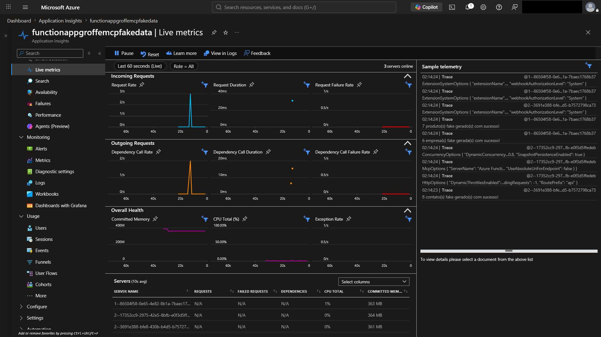
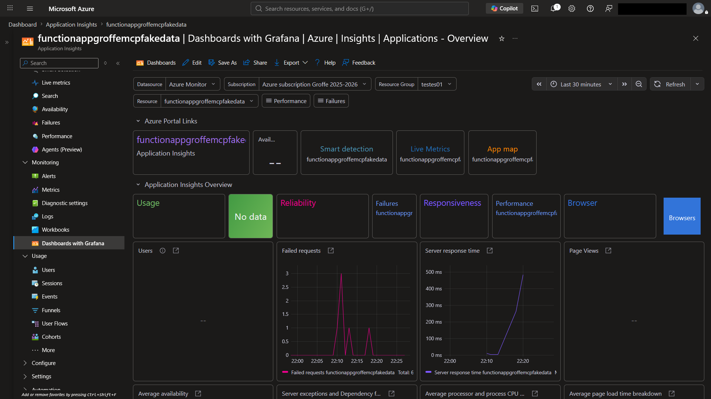
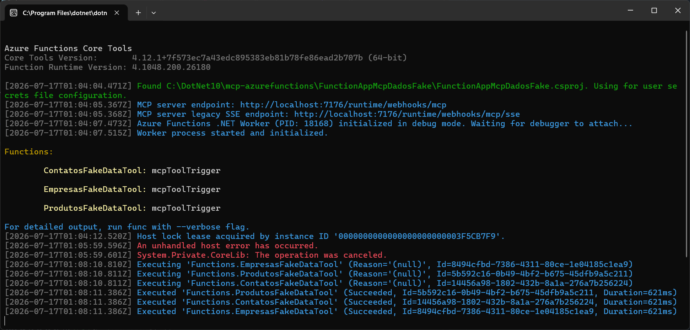
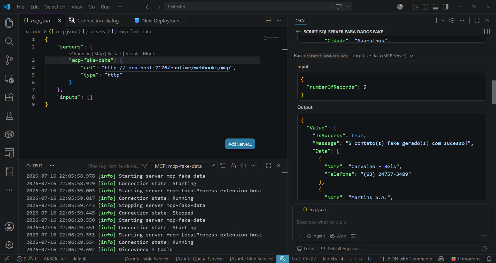
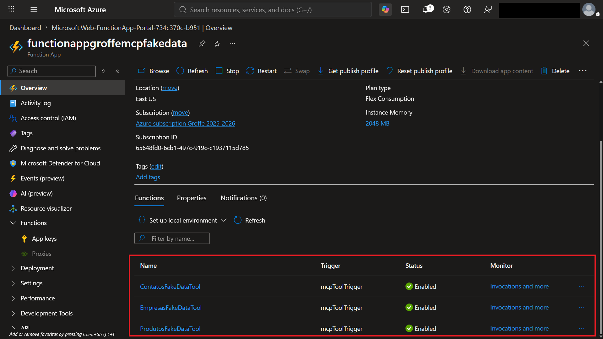
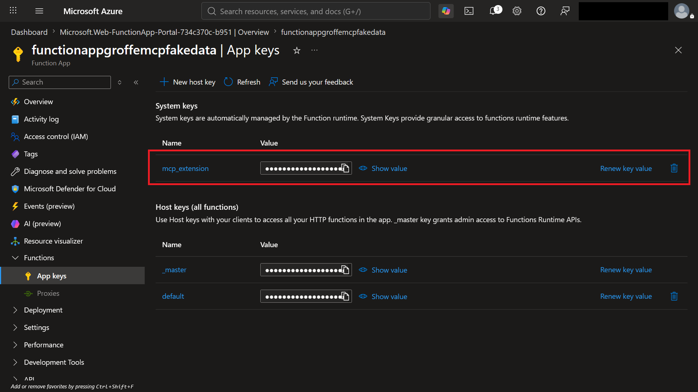
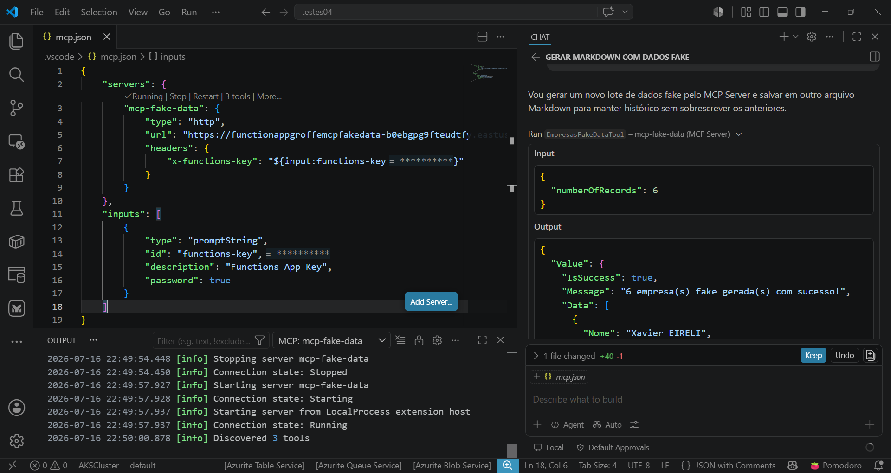

# azurefunctions-dotnet10-mcp-fakedata
Implementação com .NET 10 + Azure Functions de MCP Server (stdio) para a geração de dados fake de empresas, contatos e produtos no padrão brasileiro. Inclui o uso da biblioteca Bogus.

Live em que este exemplo foi apresentado (**canal AzureBrasil.cloud**): **https://www.youtube.com/watch?v=0aYa0y31wcw**

Monitoramento desta aplicação via **Live Metrics no Application Insights**:




Monitoramento desta aplicação via **Dashboards with Grafana**:



## Testes com aplicação executada via Visual Studio 2026

Aplicação executando localmente, com Functions expostas como Tools do MCP Server:



Arquivo mcp.json para testes via VS Code:

```json
{
	"servers": {
		"mcp-fake-data": {
			"url": "http://localhost:7176/runtime/webhooks/mcp",
			"type": "http"
		}
	},
	"inputs": []
}
```

Resultado dos testes no VS Code:

:


## Testes com aplicação publicada como Function App

Cada Tool do MCP Server corresponderá a uma função exposta através da Function App:



Arquivo mcp.json para testes via VS Code:

```json
{
	"servers": {
		"mcp-fake-data": {
			"type": "http",
			"url": "https://functionapp.region.azurewebsites.net/runtime/webhooks/mcp",
			"headers": {
				"x-functions-key": "${input:functions-key}"
			}
		}
	},
	"inputs": [
		{
			"type": "promptString",
			"id": "functions-key",
			"description": "Functions App Key",
			"password": true
		}
	]
}
```

O parâmetro **functions-key** corresponde à key **mcp_extension** (um dos benefícios em se desenvolver um MCP Server como uma Function, com uma implementação básica de segurança sem praticamente nenhum esforço de código):



Resultado dos testes no VS Code:


